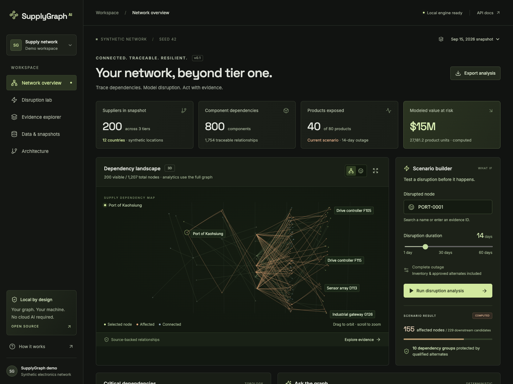
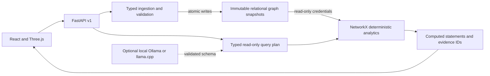

# SupplyGraph AI

### When one supplier stops, what stops next?

Trace a disruption from a sub-tier supplier or port to the products and customers that depend on it. See when inventory buffers run out, which approved alternates protect supply, and the graph evidence behind every result.

**An open-source supply-chain knowledge graph with deterministic disruption analysis and optional local AI.**

[Quick start](#quick-start) · [Explore the demo](#one-disruption-follow-the-impact) · [How it works](#how-it-works) · [Benchmarks](#measured-results) · [Contribute](#build-with-us)



*Actual application output from the included synthetic network. The screenshot shows a hypothetical scenario, not live supplier intelligence.*

**No paid APIs. No required cloud AI. The analytical core works with AI disabled.**

Built for supplier-risk teams, procurement, network planners, and operations analysts—and engineers exploring graph analytics, local LLMs, and evidence-grounded AI.

## One disruption. Follow the impact.

The demo opens with a simple question: **What happens if the Port of Kaohsiung is unavailable for 14 days?**

Using the committed seed-42 network and September 15 inventory snapshot, the application computes:

| Result | What it tells you |
|---|---|
| **229 downstream candidates** | Nodes connected to the disrupted port |
| **155 affected nodes** | Nodes that reach shortage within the scenario window |
| **40 exposed products** | Finished products whose required supply becomes unavailable |
| **27,181.15 product units at risk** | Modeled unmet production using the supplied daily demand |
| **10 protected dependency groups** | Dependencies preserved by qualified, full-capacity alternates |

These are reproducible synthetic planning results. Port names provide geographic context; supplier relationships, demand, inventory, and unit values are synthetic. Monetary exposure is a model output, not a forecast of realized revenue loss.

After [starting the app](#quick-start):

1. **Run a scenario.** Change the disrupted node or outage duration in Scenario builder.
2. **Follow the dependency.** Select an exposed product and inspect its path and evidence records.
3. **Test the inventory effect.** Switch between September 1 and September 15 snapshots.
4. **Ask the graph.** Try `Upstream suppliers of PRD-0001` or `Impact of PORT-0001 for 14 days`.
5. **Inspect the inputs.** Open Data & snapshots to review validation warnings and export the dataset.

[Full workspace screenshot](docs/screenshots/network-overview.png) · [Geographic view](docs/screenshots/global-network.png) · [Mobile view](docs/screenshots/mobile.png) · [Reproduce the screenshots](docs/screenshots/README.md)

## Why supply-chain graphs need more than reachability

A direct-supplier list rarely explains how a sub-tier outage reaches a finished product. A graph traversal finds connections, but a connected product may still have enough inventory—or an approved alternate—to keep running.

SupplyGraph distinguishes **structural exposure** from **shortage within a specific outage window**. Required dependency groups behave as AND relationships; qualified sources within a group behave as OR relationships. Lead-time buffers and inventory coverage determine when a disruption reaches the next node.

That makes the workflow useful before an LLM enters the picture: load a network, simulate an outage, inspect the consequences, and trace the evidence.

| Capability | What you can do |
|---|---|
| **Multi-tier network modeling** | Connect suppliers, sites, components, BOMs, products, facilities, ports, routes, and customers |
| **Disruption propagation** | Simulate single- or multi-node outages; inspect shortage timing and product exposure |
| **Qualified alternates** | Check approval and dedicated capacity before treating a source as protective |
| **Critical dependency analysis** | Explore paths, upstream/downstream relationships, degree, and sampled betweenness centrality |
| **Temporal snapshots** | Compare immutable network snapshots while retaining source IDs and provenance |
| **Visual investigation** | Navigate a Three.js dependency view and globe, searchable tables, and evidence drawers |
| **Graph-grounded queries** | Use supported natural-language queries with a deterministic parser or optional local model planner |
| **Reusable API** | Integrate typed, versioned analysis endpoints into another application |

## Quick start

### Docker Compose

From a local checkout or extracted source bundle:

```sh
cd supplygraph-ai
cp .env.example .env
docker compose up --build
```

Open **[localhost:8080](http://localhost:8080)**. Explore the API at **[localhost:8041/docs](http://localhost:8041/docs)**.

The first run validates and loads the committed dataset and creates two inventory snapshots. No model download, paid credentials, or external integration is required. PostgreSQL data persists in a named local volume. The first build downloads dependencies; application assets are served locally afterward.

**Current status: local release candidate.** Native workflows have been verified. Compose configuration is included, but Docker startup, the PostgreSQL roundtrip, and hosted GitHub CI remain open [release gates](docs/release-checklist.md). Use the verified macOS native path below if Docker is unavailable.

Use Docker Engine with Compose; Docker Desktop is optional and has separate licensing terms. Stop with `docker compose down`. Add `-v` only when you intend to delete persisted demo data.

<details>
<summary><strong>Native development: macOS / Linux</strong></summary>

Requirements: Python 3.12+, Node.js 22+, and pnpm 11.25.0. Native mode uses SQLite.

From the repository root:

```sh
python3 -m venv .venv
source .venv/bin/activate
python -m pip install -r requirements.lock
python -m pip install --no-deps -e .
uvicorn apps.api.main:app --host 127.0.0.1 --port 8041
```

In a second terminal, from the repository root:

```sh
cd apps/web
corepack enable
corepack prepare pnpm@11.25.0 --activate
pnpm install --frozen-lockfile
pnpm dev
```

Open **[localhost:5197](http://localhost:5197)**.

Native startup uses process environment variables and does not automatically read `.env`. Defaults: `sqlite:///./supplygraph.db`, demo enabled, AI disabled, and external ingestion disabled. See [AI configuration](docs/ai-design.md) to connect a local runtime. This path was verified on macOS; Linux was not separately exercised.

</details>

<details>
<summary><strong>Native development: Windows PowerShell</strong></summary>

Install Python 3.12+, Node.js 22+, and pnpm 11.25.0. From the repository root:

```powershell
py -3.12 -m venv .venv
.\.venv\Scripts\python.exe -m pip install -r requirements.lock
.\.venv\Scripts\python.exe -m pip install --no-deps -e .
.\.venv\Scripts\python.exe -m uvicorn apps.api.main:app --host 127.0.0.1 --port 8041
```

In another PowerShell terminal, from the repository root:

```powershell
cd apps/web
corepack enable
corepack prepare pnpm@11.25.0 --activate
pnpm install --frozen-lockfile
pnpm dev
```

Open **[localhost:5197](http://localhost:5197)**. Set native options with `$env:AI_ENABLED="true"` and `$env:AI_BASE_URL="http://127.0.0.1:11434"` before starting the API. Native startup does not automatically read `.env`.

These commands are documented but were not executed on the macOS verification host.

</details>

### Optional local AI

The default demo uses a deterministic query parser. Enable **Ollama** or **llama.cpp** to let a local model map supported questions to typed, read-only graph operations. The calculations and evidence requirements stay the same.

The Ollama Compose profile, native runtime settings, model selection, and licensing notes are in [AI design](docs/ai-design.md). Model weights are downloaded separately under their own licenses. No proprietary AI service is required.

## How it works

<!-- diagram-id: supplygraph-architecture -->


Business logic lives in `src/supplygraph`, separate from HTTP routes and UI components. Compose uses PostgreSQL relational graph tables; native development uses SQLite. NetworkX executes graph algorithms over the selected snapshot.

**The AI boundary is explicit:**

| Responsibility | Implementation |
|---|---|
| Resolve a supported question into an operation | Deterministic parser or schema-validated local model plan |
| Calculate paths, inventory coverage, shortage timing, and exposure | Deterministic Python code |
| Produce business statements | Computed templates with supporting graph evidence IDs |
| Handle missing evidence or invalid model output | Abstain; preserve deterministic state |
| Record observable execution | Trace IDs, source IDs, model/configuration, tool calls, latency, retries, and validation failures |

Model output cannot execute arbitrary SQL, shell commands, or state changes. Imported text is treated as untrusted data. No private chain-of-thought is requested or exposed.

**Stack:** Python · FastAPI · Pydantic · NetworkX · SQLAlchemy · PostgreSQL / SQLite · React · TypeScript · Vite · Three.js · Ollama / llama.cpp · pytest · Vitest · Playwright.

[Architecture](docs/architecture.md) · [Data model and propagation assumptions](docs/data-model.md) · [AI design](docs/ai-design.md) · [Architecture decisions](docs/adr)

## Bring a network. Keep the provenance.

The committed dataset contains **1,207 nodes and 1,754 relationships**: 200 suppliers across three tiers, 800 components, 80 products, 25 facilities, 40 sites, 8 ports, 24 routes, and 30 customers, plus 800 inventory records.

Generate the demo again or create a larger network with a fixed seed:

```sh
python -m supplygraph.data.generator --seed 42 --output data/sample/demo.json
python -m supplygraph.data.generator --seed 73 --scale 10 --output data/generated/large.json
```

Seeded edge cases include unapproved and undersized alternates, zero stock, isolated suppliers, and an inventory warning for unknown usage. The two demo snapshots are hypothetical inventory scenarios, not historical observations.

Each record supports a stable ID, source/dataset ID, ingestion timestamp, validation status, and optional lineage. An invalid import rejects the entire dataset and produces a visible validation report. Use a new `snapshot_id` when importing changed contents.

External ingestion is disabled until the server has a `WRITE_API_TOKEN`. Configure a private token in the Compose `.env` or native process environment, restart the API, and enter it in Data & snapshots. Uploads must be `application/json`, have a `.json` filename, and be at most 25 MiB. Never commit the token.

[Dataset schema](data/schemas/dataset.schema.json) · [Data dictionary](docs/data-model.md) · [Committed demo data](data/sample/demo.json)

## Use the API

Run the same fourteen-day scenario from another application:

```sh
curl -X POST http://localhost:8041/api/v1/analysis/scenarios \
  -H 'Content-Type: application/json' \
  -d '{"snapshot_id":"DEMO-2026-09-15","disrupted_ids":["PORT-0001"],"duration_days":14}'
```

<details>
<summary><strong>Query the graph, retrieve evidence, and inspect endpoint boundaries</strong></summary>

```sh
curl http://localhost:8041/api/v1/snapshots

curl -X POST http://localhost:8041/api/v1/analysis/query \
  -H 'Content-Type: application/json' \
  -d '{"snapshot_id":"DEMO-2026-09-15","question":"Impact of PORT-0001 for 14 days","use_llm":false}'

curl 'http://localhost:8041/api/v1/evidence/PORT-0001?snapshot_id=DEMO-2026-09-15'
```

Read-only endpoints under `/api/v1`: `/snapshots`, `/overview`, `/nodes?limit=50&offset=0`, `/graph`, `/critical`, `/evidence/{id}`, `/validation-reports`, and `/snapshots/{id}/export`. The `/analysis/*` POST endpoints compute results without mutating state.

The sole mutation is `POST /api/v1/ingestions`, requiring multipart `file`, `Authorization: Bearer ...`, and `Idempotency-Key`. Repeating a key with identical content succeeds idempotently; conflicting content returns 409. Errors include a stable code, message, trace ID, and optional validation details.

OpenAPI is available at `/openapi.json`; interactive documentation at `/docs` uses bundled local assets.

</details>

## Measured results

### Verification you can inspect

Recorded on September 27, 2026; see the [verification record](docs/verification.md) for scope and environment.

| Check | Observed result |
|---|---|
| Backend tests | **60 passed**; 1 PostgreSQL test skipped because no server was available |
| Frontend tests | **3 passed** |
| Browser workflows | **4 passed**: desktop, mobile/errors, keyboard/accessibility, and local API docs |
| Static checks and frontend production build | Passed |
| Local model smoke evaluation | **10/10 expected outcomes**, Qwen3-8B Q4_K_M through Ollama 0.34.4 |

The small deterministic golden set checks ten query intents, seven hand-audited propagation cases, one alternate fixture, and 22 template claims. It returned 100% query accuracy and impact precision/recall, the expected alternate selection, and zero missing or invalid citations. These fixtures verify defined behavior; they do not establish real-world accuracy or measure arbitrary narrative hallucinations.

### Graph performance at 1k, 10k, and 100k nodes

Actual measurements on **Apple M5, 10 logical CPUs, macOS 26.6.2, Python 3.12.14, NetworkX 3.7**. No LLM runs in the performance path. The workload is an eight-layer DAG with a shared risk root; the 100k scenario affects 87,520 nodes. Five impact repetitions after warm-up, with **memory tracing enabled**:

| Nodes | Edges | Impact median | Impact p95 | Peak traced Python allocations |
|---:|---:|---:|---:|---:|
| 1,000 | 1,124 | 29.60 ms | 29.99 ms | 6.80 MiB |
| 10,000 | 11,249 | 324.68 ms | 332.04 ms | 65.95 MiB |
| 100,000 | 112,499 | 3,778.07 ms | 3,804.32 ms | 679.39 MiB |

These are in-process microbenchmarks, excluding HTTP, database access, browser rendering, and inference. Memory excludes native/GPU allocations. Five samples do not establish an SLA.

[Benchmark summary](docs/benchmarks/example/summary.md) · [Raw JSON](docs/benchmarks/example/results.json) · [Performance CSV](docs/benchmarks/example/performance.csv) · [Local-model results and configuration](docs/benchmarks/local-qwen3/results.json)

### Reproduce the checks

```sh
# Activated Python environment; pnpm available
sh scripts/verify.sh

# Writes JSON, CSV, and Markdown with hardware/configuration metadata
python -m supplygraph.evaluation.benchmark --output output/benchmarks

# With the API and frontend running
cd apps/web
pnpm exec playwright install chromium
pnpm test:e2e
```

Windows: run `python -m ruff check src apps/api tests` and `python -m pytest` from the root, then `pnpm lint`, `pnpm typecheck`, `pnpm test`, and `pnpm build` inside `apps/web`. Browser tests accept `E2E_BASE_URL` for the Compose URL and `E2E_CHANNEL=chrome` for installed Chrome.

GitHub Actions definitions cover backend/PostgreSQL tests, frontend checks, dependency audits, Docker build/startup, and browser E2E. Hosted CI has not yet run; configured workflows are not passing-build claims. [Evaluation methodology](docs/evaluation.md) · [Release checklist](docs/release-checklist.md)

## Scope, assumptions, and security

**Operational screening model.** Current assumptions include complete outages, constant demand, aggregate non-overlapping inventory/lead-time buffers, and instant dedicated alternates. The model does not allocate shared capacity, pool partial alternatives, model qualification delays, optimize production, simulate recovery/backlogs, or assign disruption probabilities. BOM quantities inform supplied usage; this is not an MRP optimizer. Cycles are rejected.

**Synthetic demonstration network.** There are no live risk feeds, verified supplier relationships, or claimed ERP integrations. The Three.js view shows a bounded neighborhood; calculations use the selected full snapshot. Entity matching can abstain, and large analyses can be dominated by evidence serialization and memory.

**Local deployment boundary.** The demo exposes read access on loopback and supports an administrative write token. Do not expose it directly to the internet. Compose defines scoped graph reader/writer roles. Production deployment still requires authenticated reads, identity and authorization, TLS, rate limits, secret management, migrations, and backup/recovery controls.

[Model assumptions](docs/data-model.md) · [Threat model](docs/security.md) · [Report a vulnerability](SECURITY.md)

## Find your way around

| Resource | Start here for |
|---|---|
| [Architecture](docs/architecture.md) | Service boundaries, persistence, and design tradeoffs |
| [Data model](docs/data-model.md) | Entity definitions, dependency semantics, and propagation equations |
| [AI design](docs/ai-design.md) | Local runtimes, typed plans, abstention, and telemetry |
| [Evaluation](docs/evaluation.md) | Ground truth, metrics, workloads, and reproducibility |
| [Dependency licenses](docs/open-source-licenses.md) | Material dependency and model-license notes |
| [Roadmap](docs/roadmap.md) | The next five engineering priorities |

<details>
<summary><strong>Repository layout</strong></summary>

```text
apps/api/                   Thin ASGI entry point and container
apps/web/                   React + TypeScript + Three.js application
src/supplygraph/
  domain/                   Schemas and deterministic graph algorithms
  data/                     Generator, validation and persistence
  services/                 Application orchestration and graph views
  ai/                       Local adapters, typed planning, cited templates
  evaluation/               Golden fixtures and benchmark harness
  observability/            JSON logging and trace context
data/sample/                Committed synthetic graph
data/schemas/               JSON Schema
tests/unit/                 Domain, schema and AI failure regression tests
tests/integration/          API, database, ingestion and security boundaries
tests/e2e/                  Desktop/mobile/browser accessibility workflows
tests/benchmarks/           Evaluation output contract test
scripts/                    Verification, Docker smoke test and DB roles
docs/                       Architecture, assumptions, security, ADRs, results
.github/workflows/          CI, builds and dependency checks
```

[Full tracked-file tree](docs/repository-tree.md)

</details>

## Build with us

Useful contributions start with a concrete supply-chain question and a reproducible example. Add a hand-solved disruption fixture, challenge a modeling assumption, improve an evidence workflow, or benchmark another local model. Keep submitted data synthetic or explicitly licensed for redistribution.

The next five priorities are:

1. **Capacity-constrained material flow** with shared stock, BOM allocation, and recovery.
2. **Bitemporal storage and migrations** with snapshot deltas and restoration tests.
3. **A larger independent evaluation corpus** with adversarial queries and property tests.
4. **End-to-end scale testing** with bounded concurrency and PostgreSQL load measurements.
5. **Authenticated operator workflows** with read roles, persisted audits, and mitigation comparisons.

Read [CONTRIBUTING](CONTRIBUTING.md), the [detailed roadmap](docs/roadmap.md), and the [Code of Conduct](CODE_OF_CONDUCT.md) before opening a contribution.

**Found this useful?** Star the repository to follow its progress, or share it with someone working on supplier risk, network planning, or graph-grounded AI. A reproducible scenario or thoughtful issue is especially welcome.

## License

Project code and generated data are licensed under **[Apache-2.0](LICENSE)**. Dependencies and model weights retain their own licenses, including psycopg's LGPL and font OFL terms. See [open-source license notes](docs/open-source-licenses.md).

No paid API or proprietary cloud AI is required for any core feature.
